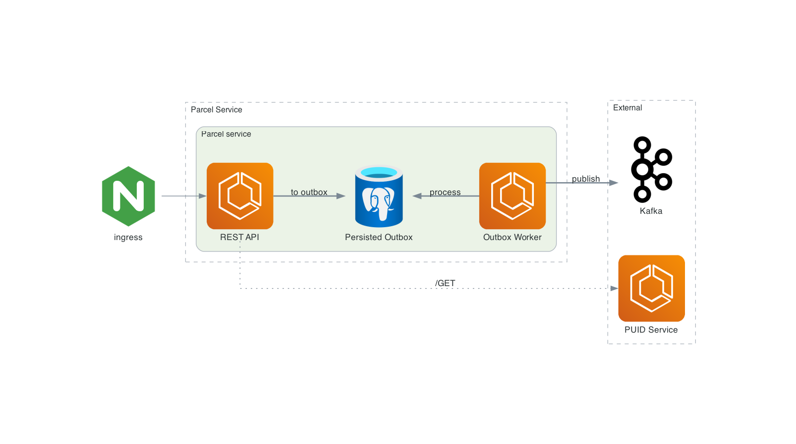

All diagrams here are created with [Diagrams](https://diagrams.mingrammer.com/). Simple, nifty Diagram as a Code tool. 

To update/generate diagrams simply run:

```bash

python <file_name.py> 
```

i.e.
```bash
python parcel_service_with_outbox.py
```


## Parcel Service with outbox pattern


## Infrastructure overview
