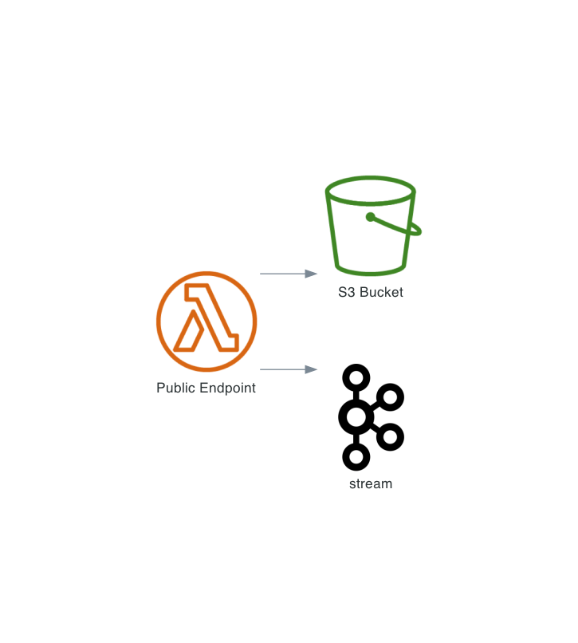
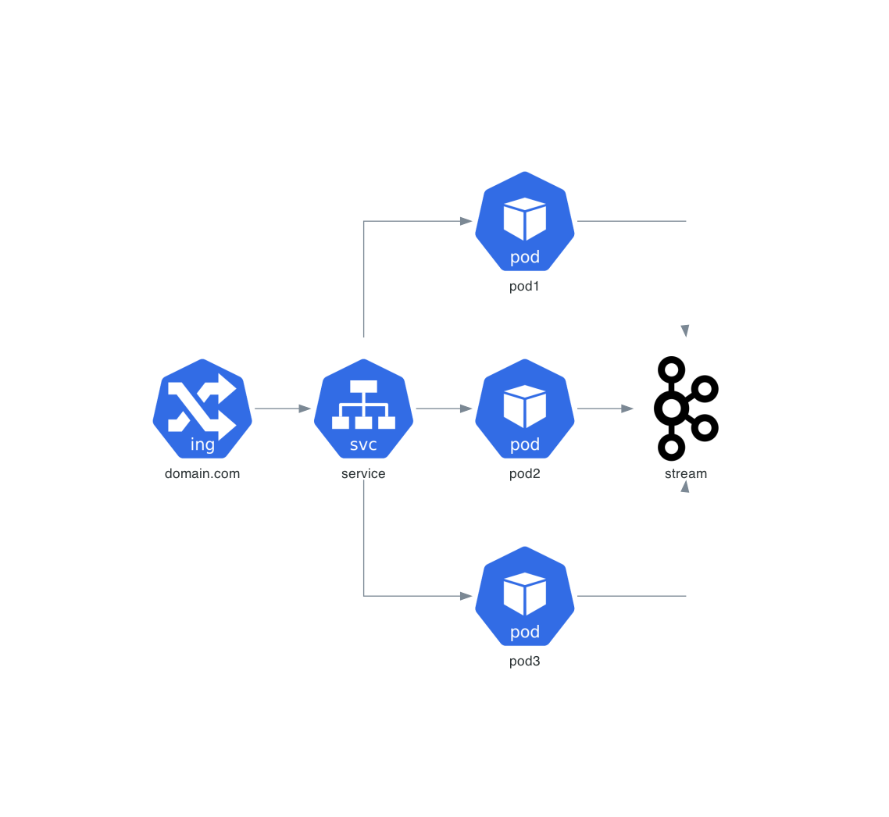
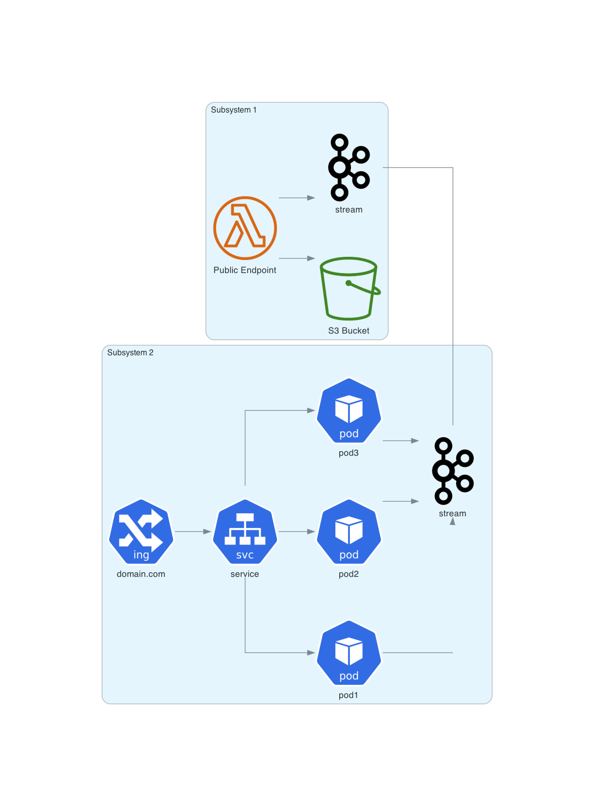

Working with diagrams in a more complex solutions often requires to show different perspective on a system. More than often we need to draw view from numerous angles. With Diagram as as Code approach it's quite easy to mix and match once defined diagram without continuos copy/paste method. Simply follow DRY principle. 

Bellow you can see working PoC. Different library may require different steps but you get the idea. 

To mix and match diagrams we can wrap each diagram in a function. Below theres just and example of imaginary system. Later we will be creating a combined diagram connecting different partial diagrams, so here we return kafka (just as an example).

```python
from diagrams.aws.compute import ECS
from diagrams.aws.compute import LambdaFunction
from diagrams.aws.storage import SimpleStorageServiceS3Bucket
from diagrams.onprem.queue import Kafka


def subsystem1():
    enpoint = LambdaFunction("Public Endpoint")
    bucket = SimpleStorageServiceS3Bucket("S3 Bucket")
    kafka = Kafka("stream")

    enpoint >> [bucket, kafka]
  
    return kafka
```
No we need another subsystem:

```python
from diagrams.k8s.network import Ingress, Service
from diagrams.k8s.compute import Pod
from diagrams.onprem.queue import Kafka

def subsystem2():
    ingress = Ingress("domain.com")
    service = Service("service")
    kafka = Kafka("stream")

    ingress >> service >>[
        Pod("pod1"),
        Pod("pod2"),
        Pod("pod3"),
    ] >> kafka
  
    return kafka
```
Just like before we want to return kafka. We could return a tuple of multiple elements though. For the sake of example lets keep it as simple as possible.

Now the fun part. Lets create 3 diagrams. Two subsubsystems and one combined one. 

```python
from diagrams import Diagram, Cluster
from architecture_diagrams.joining_poc_diagram1 import subsystem1
from architecture_diagrams.joining_poc_diagram2 import subsystem2
from tools.DiagramTools import based_on_params

show_image = based_on_params()

# generate diagram for system 1
with Diagram(show=show_image, direction="LR", filename="poc_diagram1", outformat="png"):
    subsystem1()

# generate diagram for system 2
with Diagram(show=show_image, direction="LR", filename="poc_diagram2", outformat="png"):
    subsystem2()


# generate diagram for combined systems
with Diagram(show=show_image, direction="LR", filename="poc_combined", outformat="png"):
    with Cluster("Subsystem 1"):
        kafka1 = subsystem1()

    with Cluster("Subsystem 2"):
        kafka2 = subsystem2()

    kafka1 - kafka2
```

Now running the last scrip will generate the following images:

First subsystem:


Second subsystem:


Combined diagrams:
